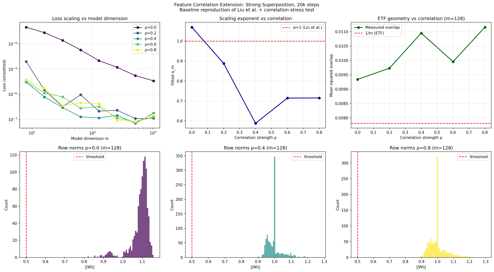
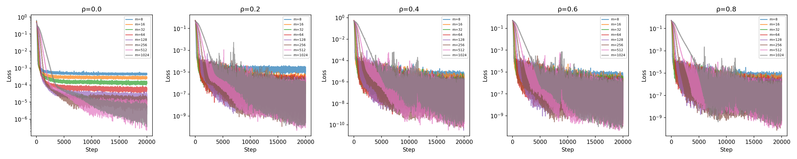
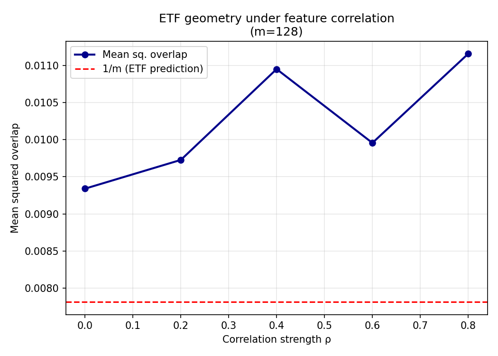
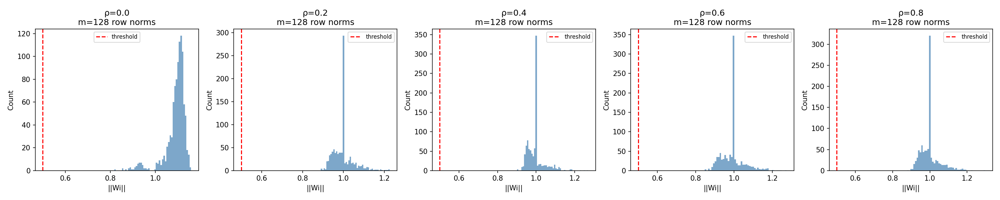
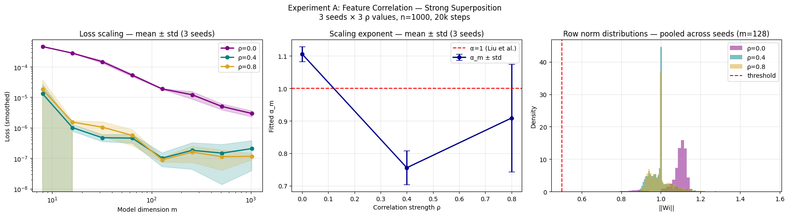
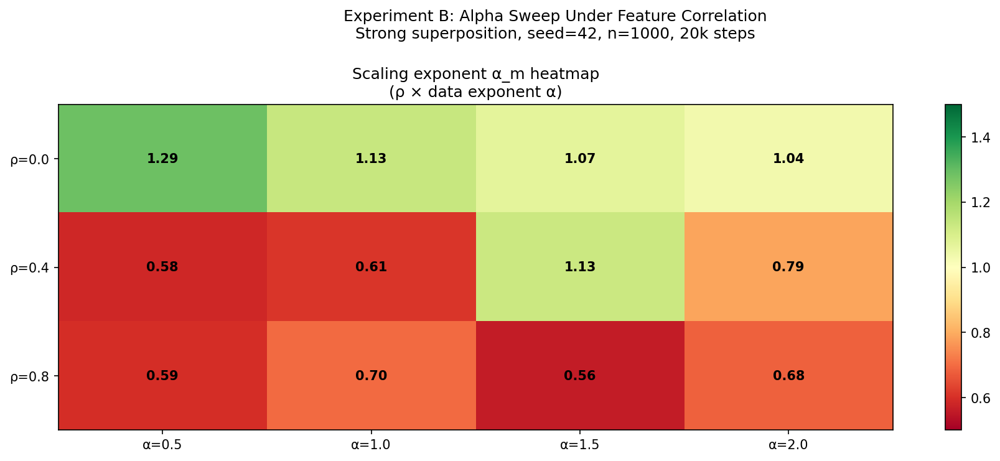
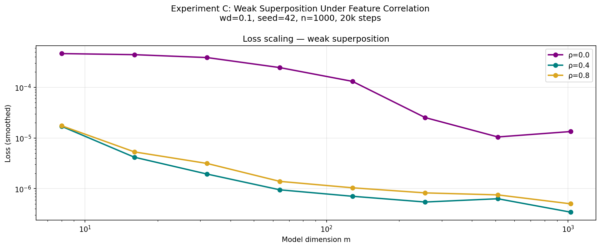

# Superposition Scaling: Feature Correlation Extension

Extension of [Liu et al. (2025)](https://github.com/liuyz0/SuperpositionScaling) 
"Superposition Yields Robust Neural Scaling" (NeurIPS 2025).

This repository stress-tests the paper's central geometric assumption — 
that features activate independently — by introducing block-correlated 
feature activations into the toy model and measuring the effect on 
loss scaling and ETF geometry.

---

## Background

Liu et al. show that strong superposition forces representation vectors 
toward an ETF-like geometry whose 1/m interference structure produces 
robust 1/m loss scaling, independent of the feature frequency 
distribution. However, their toy model assumes features activate 
independently. In natural language, semantically related concepts 
co-occur far more than chance would predict. This extension tests 
whether the ETF geometry and 1/m scaling survive when this assumption 
is violated.

---

## Repository Structure
---

## Experiments

### Experiment 0 — Exploratory Baseline
Single seed, all 5 rho values {0, 0.2, 0.4, 0.6, 0.8}, strong 
superposition. Reproduces Liu et al.'s result and motivates 
multi-seed analysis.

### Experiment A — Multi-Seed Correlation Sweep
3 seeds × 3 rho values {0.0, 0.4, 0.8}, strong superposition. 
Statistically reliable estimates with error bars.

### Experiment B — Alpha Sweep
3 rho values × 4 data exponents {0.5, 1.0, 1.5, 2.0}, single seed, 
strong superposition. Tests whether correlation effect is 
distribution-specific.

### Experiment C — Weak Superposition Comparison
3 rho values, single seed, weak superposition (weight_decay=0.1). 
Tests whether the two regimes are disrupted differently.

---

## Key Findings


**Finding 1 — Baseline reproduction**  
At rho=0, alpha_m = 1.106 ± 0.023, reproducing Liu et al.'s result.

**Finding 2 — Scaling exponent degrades under correlation**  
At rho=0.4, alpha_m drops to 0.755 ± 0.052 across 3 seeds — a 
statistically meaningful deviation with tight error bars. At rho=0.8, 
alpha_m partially recovers to 0.909 ± 0.166 with high variance, 
suggesting unstable optimization at extreme correlation.

**Finding 3 — ETF geometry collapses**  
Row norm distributions collapse from heterogeneous spread at rho=0 
to a sharp spike at exactly 1.0 under correlation, consistent across 
all seeds and data exponents. Mean squared overlaps increase 
monotonically above the ETF prediction of 1/m, from 1.20x at rho=0 
to 1.43x at rho=0.8.

**Finding 4 — Effect is general across data exponents**  
alpha_m remains near or above 1 for all alpha values when rho=0, 
but drops to 0.56-0.79 at rho >= 0.4 across all distributions tested 
(alpha in {0.5, 1.0, 1.5, 2.0}).

**Finding 5 — Weak and strong superposition fail differently**  
Strong superposition forces uniform unit-norm representations under 
correlation. Weak superposition causes norm collapse toward zero — 
the model abandons feature representation almost entirely. These 
contrasting failure modes suggest correlation affects the two regimes 
through fundamentally different mechanisms.

---

## Key Result



*Feature correlation disrupts ETF geometry and degrades 1/m loss 
scaling under strong superposition.  
Top row (left to right): smoothed 
loss scaling curves, fitted scaling exponent alpha_m vs correlation 
strength rho, mean squared overlap vs rho (ETF prediction = 1/m).   
Bottom row: row norm distributions at rho={0.0, 0.4, 0.8} showing 
collapse from heterogeneous spread to sharp spike at 1.0.*

## Misc. Figures

### Experiment 0: Training Curves

*Training loss over 20k steps. At rho=0, clean convergence. 
At rho >= 0.2, noisy and poorly separated curves.*

### Experiment 0: ETF Geometry

*Mean squared overlap increases monotonically above 1/m as rho 
increases, indicating degrading ETF geometry.*

### Experiment 0: Row Norm Distributions

*At rho=0, heterogeneous norms consistent with importance-based 
representation. At rho >= 0.2, sharp spike at 1.0.*

### Experiment A: Multi-Seed Results

*Left: loss scaling with std bands.  
Middle: alpha_m with error bars 
showing statistically meaningful degradation at rho=0.4.  
Right: row norm collapse consistent across seeds.*

### Experiment B: Alpha Sweep Heatmap

*alpha_m heatmap across rho × data exponent. rho=0 row consistently 
green; rho >= 0.4 rows consistently red across all distributions.*

### Experiment C: Regime Comparison

*Weak superposition norms collapse toward zero under 
correlation, unlike strong superposition which collapses to 1.0.*

---

## Citation

**Original paper:**
```bibtex
@inproceedings{liu2025superposition,
  title={Superposition Yields Robust Neural Scaling},
  author={Liu, Yizhou and Liu, Ziming and Gore, Jeff},
  booktitle={NeurIPS},
  year={2025}
}
```
---
